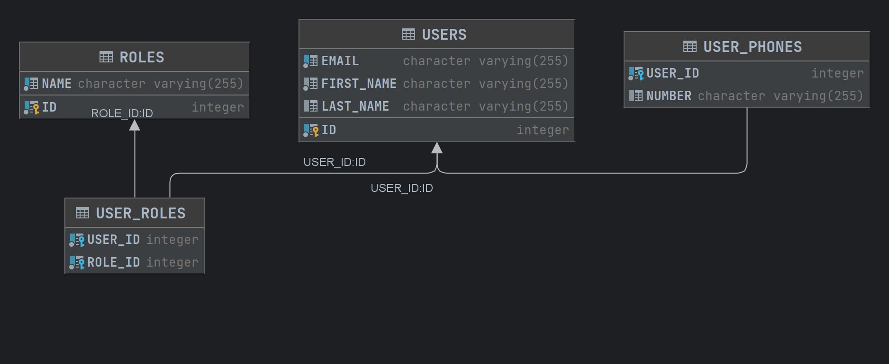

# Itexus-test
## Условия тестового задания:
Создать пользователя со следующими параметрами: 
- имя, 
- фамилия, 
- e-mail,
- роли,
- мобильные телефоны
  
и сохранить его в файл. 

- Количество ролей и телефонов от 1 до 3-х.
- При попытке ввести некорректное кол-во записей выводить сообщение о том, что кол-во неверно и дать повторить попытку ввода.
- Телефоны должны быть в виде 375*********, к примеру, | 37500 1234567 |

- Email в виде ******* @ **.*, к примеру, | any@email.com |

Редактировать уже существующего пользователя.
Удалить пользователя.
Получать информацию о пользователе, его ролях и телефонах (вывод на консоль).

## Что было сделано:
- Разработано CRUD приложение с REST API с использованием слоев контроллера, сервиса и репозитория.
- Создано 4 таблицы в базе данных H2: `users`, `roles` и таблицы связей `user_phones`, `user_roles`
- Реализована валидация данных на уровне DTO и на уровне модели с использованием аннотаций `@NotNull`, `@NotBlank`, `@Pattern` и `@Email`.
- Реализована проверка данных на уровне сервиса
- Есть логирование, вывод данных о пользователях и основных операций в консоль.
- Настроена база данных H2 для хранения данных пользователей, ролей и телефонов.
- Реализованы методы для создания, редактирования, удаления и получения информации о пользователях с помощью API
- Добавлены примеры использования и инструкции по запуску приложения.
- 
Схема БД


## Валидация данных:
- **Имя firstName**:
  - Обязательное, ненулевое, не пустое поле.
  
- **Фамилия lastName**:
  - Может быть Null.

- **Email**:
  - Должен содержать как минимум один символ до `@`, как минимум один после него и как минимум один после точки.

- **Мобильные телефоны phones**:
  - Должны быть в формате `375*********`, например, `375001234567`.
  - Минимум 1 максимум 3 телефона.
  
- **Роли roles**:
  - Минимум 1 максимум 3 роли.
  - Если такой роли нет в БД то она создается в таблице
  
### Пример JSON и адрес для POST запроса для сохранения пользователя:
`POST http://localhost:8080/api/users`

```json
{
  "firstName": "Илон",
  "lastName": "Маск",
  "email": "elon@musk.com",
  "phones": [
    "375333236356"
  ],
  "roles": [
    "USER",
    "ADMIN",
    "MODERATOR"
  ]
} 
```

### Пример JSON ответа и адрес GET запроса для получения пользователя:
`GET localhost:8080/api/users/4`

```json
{
    "id": 4,
    "firstName": "Майк",
    "lastName": "Петров",
    "email": "mike.doe@example.com",
    "phones": [
        "375221234567",
        "375991234567",
        "375881234567"
    ],
    "roles": [
        "USER"
    ]
}
```

### Пример JSON и адрес для PUT запроса для изменения данных пользователя:
`PUT localhost:8080/api/users/1`

```json
{
  "firstName": "Edit",
  "lastName": "User",
  "email": "test@example.com",
  "phones": [
    375441234567
  ],
  "roles": [
    "ADMIN",
    "MODERATOR"
  ]
}
```

### Пример DELETE запроса для удаления пользователя:
`localhost:8080/api/users/1`

### Контакты
https://t.me/VasiliBondarenko
https://www.linkedin.com/in/vasili-bandarenka/
+375333236356
+375447043185